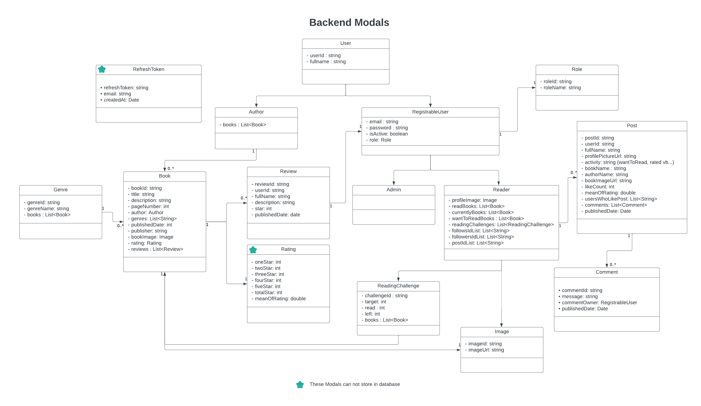

# Booke Project

Booke is a mobile application where people save the books they are reading
and follow other readers. This project backend is written with Java Spring Boot and Mobile application
was generated with React Native.

## Brief Description of Project

Booke is a mobile application where users can save the books they want to read or
store the books they have read. Readers must be registered this app for these actions.
In this app, readers can search books and they can view book's page number, author, book's rating and 
reviews. Users can mark the book with the following 3 options:
Currently Reading, Want to Read, Read. Books marked by the reader can be displayed on the profile screen.
Also, readers can start Reading challenges and they can set a goal based on how many books they want to read this year.
If user finishes a book, the user can rate this book or the reader can write what he thinks about the book.
Users can search other readers and can follow them. Thus, they can view the books read by these users
and they can view the posts of these users. Also, they can like and comment on these posts.

## Technologies

#### Backend
<ul>
    <li>Java 17</li>
    <li>Spring Boot 3.2.0</li>
    <li>Spring Security</li>
    <li>Spring Data Elasticsearch</li>
    <li>Spring Data Redis</li>
    <li>Elasticsearch 8.10</li>
    <li>Redis</li>
    <li>Docker</li>
    <li>Jwt</li>
    <li>Cloudinary</li>
    <li>Kibana</li>
</ul>

#### Mobile
<ul>
    <li>JavaScript</li>
    <li>React Native</li>
    <li>Tailwind CSS</li>
    <li>Axios Interceptors</li>
    <li>React Hook Form</li>
    <li>Expo Image Picker</li>
</ul>

## Usage of Technologies

#### Backend

Rest api was generated with Java Spring Boot. For database and search operations,
Elasticsearch was used. The book and user search process in the app was performed with the 
elasticsearch autocomplete function. In data access layer, ElasticsearchOperations and
ElasticsearchRepository were used to access data.
Spring Security and Jwt were used for authorization and authentication processes.
In this app, 2 tokens are generated: Access Token and Refresh Token.
Refresh token was stored in Redis and the purpose of this token is to renew the access token
when it expires. Access token is used for authorization. Redis was also used for caching genres. 
Cloudinary was used to store book images. Kibana was used to visualize the data stored in elasticsearch.
For working with elasticsearch, kibana and redis, docker was used. All backend 
api requests are in postman_requests directory. If you want to use them, you can
download this json file and import to postman.

#### Mobile

Mobile app was generated React Native with Expo. Written by JavaScript.
Jwt token was stored in Expo Secure Store. In HomeScreen, posts are brought with pagination.
When you scroll to the bottom of the screen, the posts of the next page are listed automatically.
Also, posts refresh if you swipe to the top of the screen.
In login and register screen, react hook form was used for validation.
Axios was used to get and post data from Backend Rest APIs. 
Axios Interceptor was used to add a jwt token to the requests. It 
was also used to refresh access token automatically when it expired. Expo
Image Picker was used for selecting image from image library for the reader's
profile picture. Tailwind CSS was used for App UI design. 

## Architecture of the Project

## Schema Modals of the Project

## How can I use this project?

1. Clone or Download as zip folder of this repository

        git clone https://github.com/VonHumbolt/BookeProject.git

2. For adding book and profile image, go into .env file
and replace '*****' with your cloudinary api.
   (Note: cloudinary.com after you go to the website and create an account, you can create an api for free!)

        CLOUDINARY_API_URL=cloudinary://*****

3. Open cmd in the project root. And, run docker compose file with following command:

        docker compose up -d

4. Start backend project located in /src/main/java path. The ports on which the backend tools work are as follows:
        
        Backend project is running on localhost:8080
        Elasticsearch is running on localhost:9200
        Kibana is running on localhost:5601
        Redis is running on localhost:6379

5. There is a sample postman requests json file in the postman_requests directory.
If you want to use it, you can download this file and import it to postman.
All the requests which I use in this project will appear on postman.
Firstly, you must create an account and then login with it. Then, you need to use
the token which is generated after login process for requests.

7. For the mobile app, if you haven't installed expo before, you can install expo using the following command in cmd:

        npm install -g expo-cli

8. Go to /src/main/booke-mobile-app path in cmd. And, run this command to create node_modules.

        npm install

9. Go to Interceptor.js class located in booke-mobile-app/utils/interceptors path. 
Then, in row 16, replace <YOUR_LOCALHOST_IP> with your wireless LAN adapter Wi-fi 
IPv4 Address.

         baseURL: "http://<YOUR_LOCALHOST_IP>:8080/"

10. Go to AuthService.js class located in booke-mobile-app/services path. 
Then, in row 5, replace <YOUR_LOCALHOST_IP> with your wireless LAN adapter Wi-fi 
IPv4 Address.

          apiUrl = "http://<YOUR_LOCALHOST_IP>:8080/auth/";

11. Start the mobile app by running the following command on the same path.

         npx expo start

12. To open the mobile app in your physical device, use <strong>Expo Go</strong> app. 
You can download it via the Play Store or App Store.

10. After you installed Expo Go. Open your QR Scanner and scan the QR Code
which appears on the screen after running the <strong>nxp expo start</strong> command.

## Trailer of the Project

    
https://github.com/VonHumbolt/BookeProject/assets/79381882/fccc970a-ffa9-4b1d-aa41-0dd5321c2584
    

